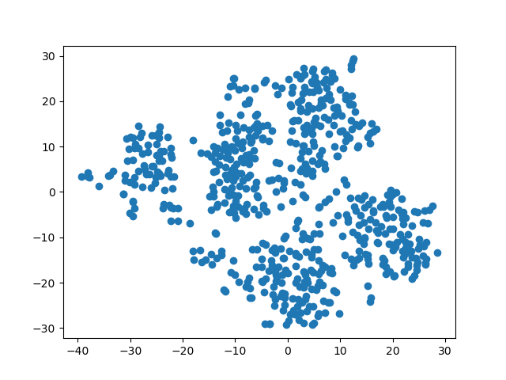
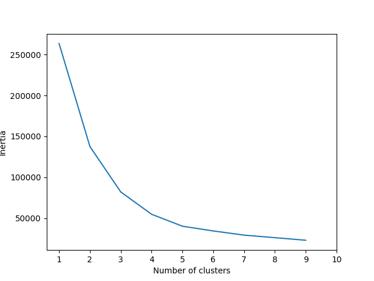
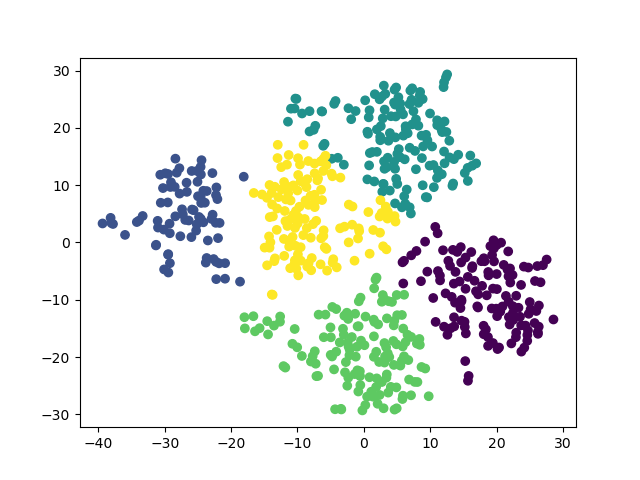

# Unsupervised-Machine-Learning-Challenge

### Glen Dagger

## Prepare the Data

The data was imported as a Pandas dataframe from the provided csv file. I removed the "MYOPIC" column and standardized the dataset using the SciKitLearn StandardScaler. The scaled dataset, X, contained 14 features and 618 rows of data.

## Apply Dimensionality Reduction

I performed the dimensionality reduction using PCA with n_components set to 0.9 in order to preserve the features that contribute to about 90% of the explained variance. This reduced the number of features from 14 to 10.

I further reduced the dataset dimensions by running t-SNE on the 10 principal components. This further reduced the dimensions from 10 down to 2. The resulting clusters were examined on a scatter plot using MatPlotLib. After trying a number of different learning_rate values for the t-SNE reduction, I settled on a value of 150. There appear to be roughly five clusters in the plot, but they are not very distinct.

## Perform a Cluster Analysis with K-means

I used a for loop to determine the inertia for k values between 1 and 10 and used these values to create an elbow plot (shown below). The resulting plot showed that the elbow occurs at k=5. I then created and fit a KMeans model to the reduced features dataset with a k value of 5. I created a dataframe from the features and their predicted classes as a new column.

## Make a Recommendation

To inspect the resulting clusters, I plotted the resulting data using the class column as the color (shown below). This showed the data can be separated into 5 distinct clusters without much overlap. My recommendation is that the patients should be clustered together into 5 groups.

